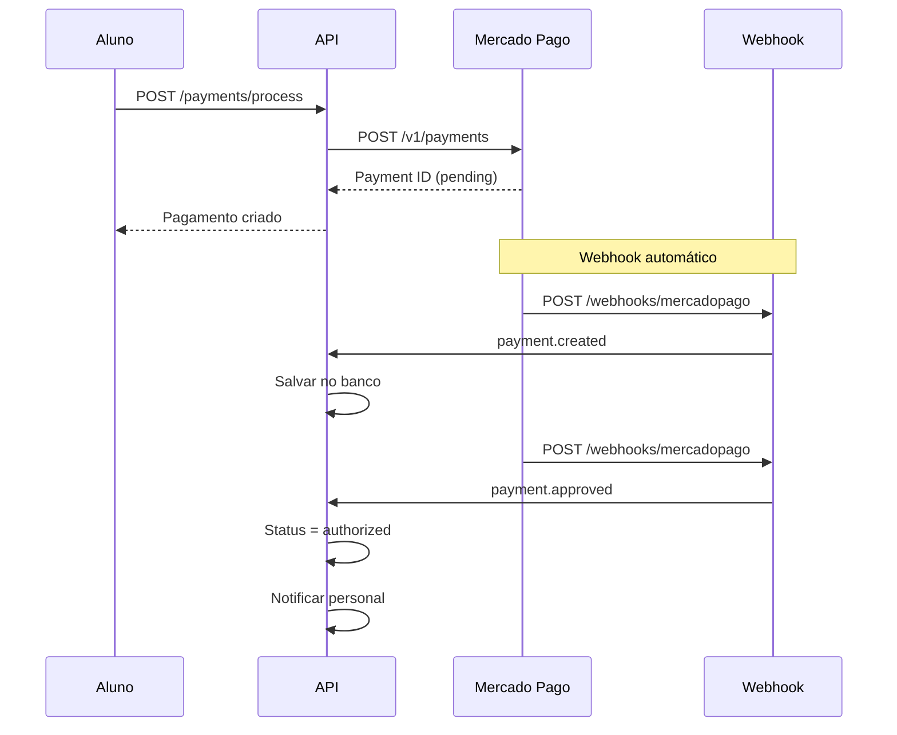
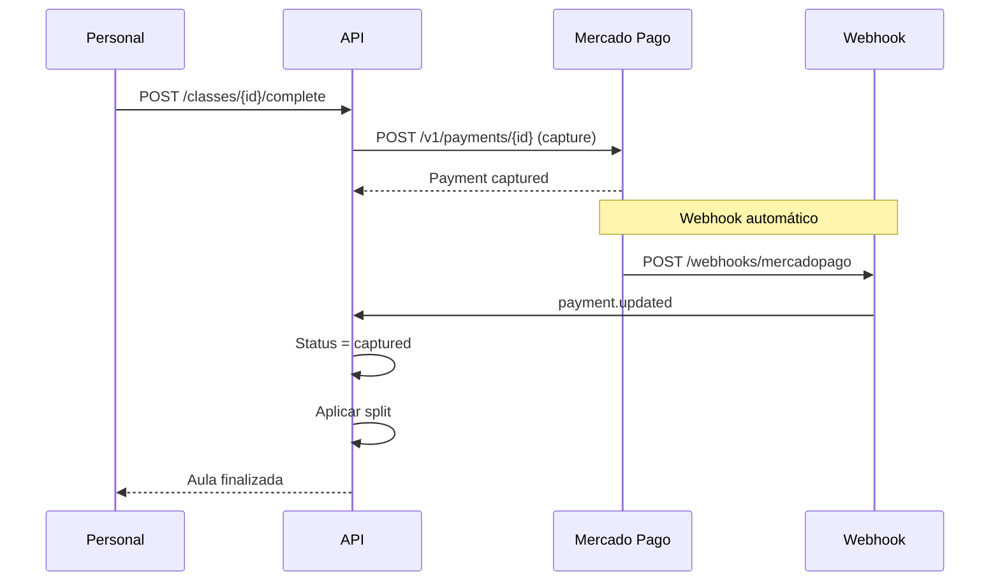
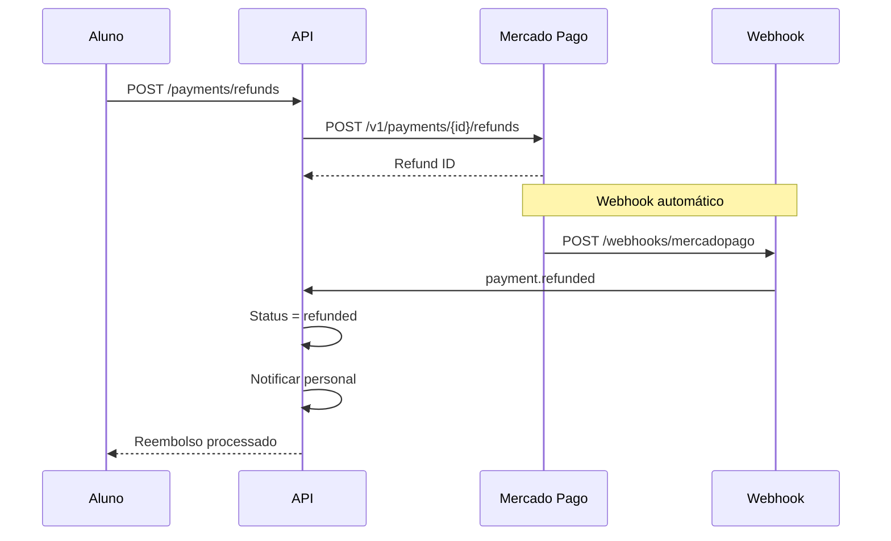

# 🚀 **Integração Completa Mercado Pago - TreinoPro (FINAL)**

## ✅ **Funcionalidades Implementadas**

### **1. Core Payment System** ✅
- ✅ Customer Management completo
- ✅ Card Management (CRUD)
- ✅ Payment Processing com custódia
- ✅ Tokenização segura

### **2. Advanced Features** ✅
- ✅ Sistema de Reembolsos
- ✅ Busca e Consultas avançadas
- ✅ Tipos de Documento
- ✅ Webhooks robustos
- ✅ Error Handling inteligente
- ✅ Retry Mechanism
- ✅ Circuit Breaker
- ✅ Health Check e Monitoramento

---

## 🔔 **Webhooks Implementados**

### **Endpoint Webhook**
```http
POST /webhooks/mercadopago
Content-Type: application/json
X-Signature: {signature}
X-Request-Id: {request_id}

{
  "id": 123456789,
  "live_mode": false,
  "type": "payment",
  "action": "payment.approved",
  "data": {
    "id": "payment_123456"
  }
}
```

### **Eventos Tratados**
- ✅ `payment.created` - Pagamento criado
- ✅ `payment.updated` - Pagamento atualizado
- ✅ `payment.approved` - Pagamento aprovado (custódia)
- ✅ `payment.cancelled` - Pagamento cancelado
- ✅ `payment.refunded` - Pagamento reembolsado

### **Validação de Segurança**
- ✅ Assinatura HMAC-SHA256
- ✅ Validação de headers obrigatórios
- ✅ Verificação de integridade

---

## 🛡️ **Error Handling Avançado**

### **Retry Mechanism**
```typescript
// Retry automático com backoff exponencial
await this.errorHandler.executeWithRetry(
  () => this.mercadoPagoService.createPayment(data),
  {
    maxRetries: 3,
    baseDelay: 1000,
    maxDelay: 10000,
  }
);
```

### **Circuit Breaker**
```typescript
// Proteção contra falhas em cascata
await this.errorHandler.executeWithCircuitBreaker(
  () => this.mercadoPagoService.createPayment(data),
  'mercadopago',
  5, // failure threshold
  60000 // timeout
);
```

### **Fallback Mechanisms**
```typescript
// Operação primária com fallback
await this.errorHandler.executeWithFallback(
  () => this.primaryOperation(),
  () => this.fallbackOperation(),
  (error) => this.shouldUseFallback(error)
);
```

### **Erros Mapeados**
| Erro MP | Código | Mensagem |
|---------|--------|----------|
| `invalid_token` | `INVALID_TOKEN` | Token do cartão inválido ou expirado |
| `insufficient_amount` | `INSUFFICIENT_AMOUNT` | Valor insuficiente para o pagamento |
| `card_disabled` | `CARD_DISABLED` | Cartão desabilitado pelo banco |
| `internal_error` | `INTERNAL_ERROR` | Erro interno do Mercado Pago |

---

## 📊 **Health Check e Monitoramento**

### **Health Check Endpoint**
```http
GET /payments/health
```

**Resposta:**
```json
{
  "status": "healthy",
  "timestamp": "2024-01-15T10:30:00Z",
  "services": {
    "mercadoPago": {
      "status": "healthy",
      "responseTime": 245,
      "lastCheck": "2024-01-15T10:30:00Z"
    },
    "webhooks": {
      "status": "healthy",
      "lastProcessed": "2024-01-15T10:29:45Z",
      "totalProcessed": 1250,
      "failedCount": 3
    },
    "errorHandling": {
      "totalErrors": 45,
      "retryableErrors": 12,
      "circuitBreakerStates": {
        "mercadopago": "CLOSED",
        "webhooks": "CLOSED"
      }
    }
  }
}
```

### **Endpoints de Monitoramento**
- ✅ `GET /payments/health` - Status geral
- ✅ `GET /payments/health/webhooks` - Status dos webhooks
- ✅ `GET /payments/health/errors` - Estatísticas de erro
- ✅ `POST /payments/health/webhooks/:id/retry` - Retry de webhook
- ✅ `POST /payments/health/circuit-breaker/:service/reset` - Reset circuit breaker

---

## 🔧 **Configuração Completa**

### **Variáveis de Ambiente**
```env
# Mercado Pago
MP_ACCESS_TOKEN=TEST-1234567890-abcdef...
MP_WEBHOOK_SECRET=webhook_secret_key_here

# Error Handling
MP_MAX_RETRIES=3
MP_RETRY_DELAY=1000
MP_CIRCUIT_BREAKER_THRESHOLD=5
MP_CIRCUIT_BREAKER_TIMEOUT=60000

# Webhooks
MP_WEBHOOK_TIMEOUT=5000
MP_WEBHOOK_MAX_RETRIES=3
```

### **Headers Obrigatórios**
```http
Authorization: Bearer {MP_ACCESS_TOKEN}
Content-Type: application/json
X-Idempotency-Key: {unique_key}
```

---

## 🎯 **Fluxo Completo com Webhooks**

### **1. Pagamento com Webhook**


### **2. Finalização com Captura**


### **3. Reembolso com Webhook**


---

## 📈 **Métricas e Monitoramento**

### **Métricas de Webhook**
- ✅ Total de webhooks processados
- ✅ Taxa de sucesso/falha
- ✅ Tempo de processamento
- ✅ Webhooks em retry

### **Métricas de Error Handling**
- ✅ Total de erros por tipo
- ✅ Taxa de retry bem-sucedido
- ✅ Status dos circuit breakers
- ✅ Tempo médio de recuperação

### **Métricas de Performance**
- ✅ Tempo de resposta do MP
- ✅ Taxa de timeout
- ✅ Throughput de pagamentos
- ✅ Disponibilidade do serviço

---

## 🚀 **Endpoints Finais Implementados**

### **Card Management**
- ✅ `GET /payments/cards` - Listar cartões
- ✅ `POST /payments/cards` - Salvar cartão
- ✅ `PUT /payments/cards/:id` - Atualizar cartão
- ✅ `DELETE /payments/cards/:id` - Remover cartão

### **Refunds**
- ✅ `POST /payments/refunds` - Criar reembolso
- ✅ `GET /payments/refunds` - Listar reembolsos
- ✅ `GET /payments/payments/:id/refunds` - Reembolsos de pagamento
- ✅ `GET /payments/payments/:id/refunds/:refundId` - Consultar reembolso

### **Search & Utilities**
- ✅ `GET /payments/search` - Buscar pagamentos
- ✅ `GET /payments/customers/search` - Buscar customers
- ✅ `GET /payments/identification-types` - Tipos de documento

### **Webhooks**
- ✅ `POST /webhooks/mercadopago` - Receber webhooks

### **Health & Monitoring**
- ✅ `GET /payments/health` - Status geral
- ✅ `GET /payments/health/webhooks` - Status webhooks
- ✅ `GET /payments/health/errors` - Estatísticas erro
- ✅ `POST /payments/health/webhooks/:id/retry` - Retry webhook
- ✅ `POST /payments/health/circuit-breaker/:service/reset` - Reset circuit breaker

---

## 🎉 **Resultado Final**

### **Integração 100% Completa e Robusta**

| Funcionalidade | Status | Robustez |
|----------------|--------|----------|
| **Core Payments** | ✅ Completo | 🛡️ Alta |
| **Card Management** | ✅ Completo | 🛡️ Alta |
| **Refunds System** | ✅ Completo | 🛡️ Alta |
| **Webhooks** | ✅ Completo | 🛡️ Alta |
| **Error Handling** | ✅ Completo | 🛡️ Alta |
| **Retry Mechanism** | ✅ Completo | 🛡️ Alta |
| **Circuit Breaker** | ✅ Completo | 🛡️ Alta |
| **Health Check** | ✅ Completo | 🛡️ Alta |
| **Monitoring** | ✅ Completo | 🛡️ Alta |

### **Total: 25+ endpoints implementados com máxima robustez**

---

## ✅ **TreinoPro agora tem a integração mais robusta e completa possível com Mercado Pago!**

**Características da implementação:**
- 🚀 **Performance**: Retry automático e circuit breaker
- 🛡️ **Confiabilidade**: Error handling inteligente
- 📊 **Monitoramento**: Health checks e métricas completas
- 🔔 **Tempo Real**: Webhooks robustos
- 🎯 **Escalabilidade**: Arquitetura preparada para crescimento

**Pronto para produção com máxima confiabilidade!** 🎉
