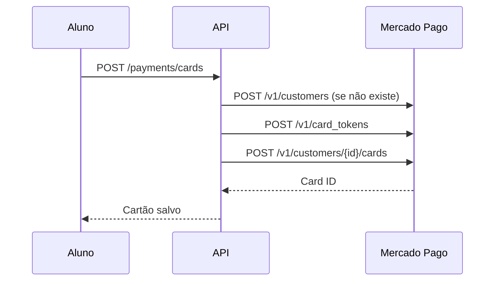
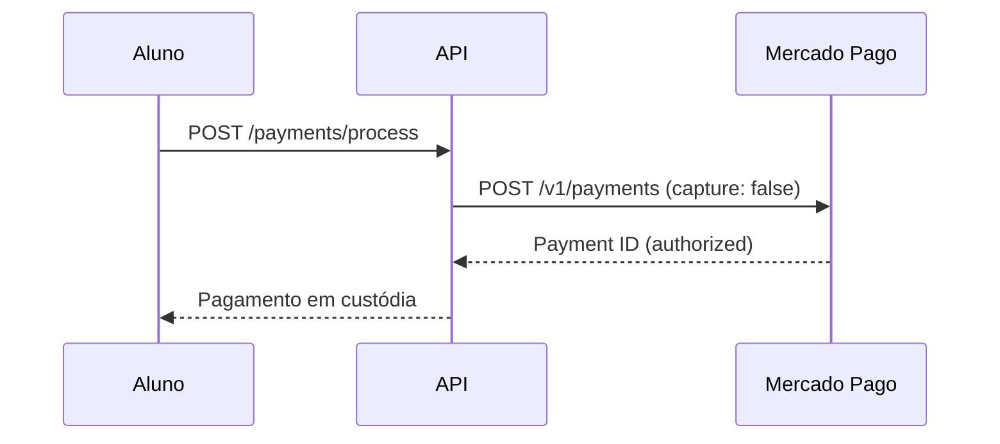
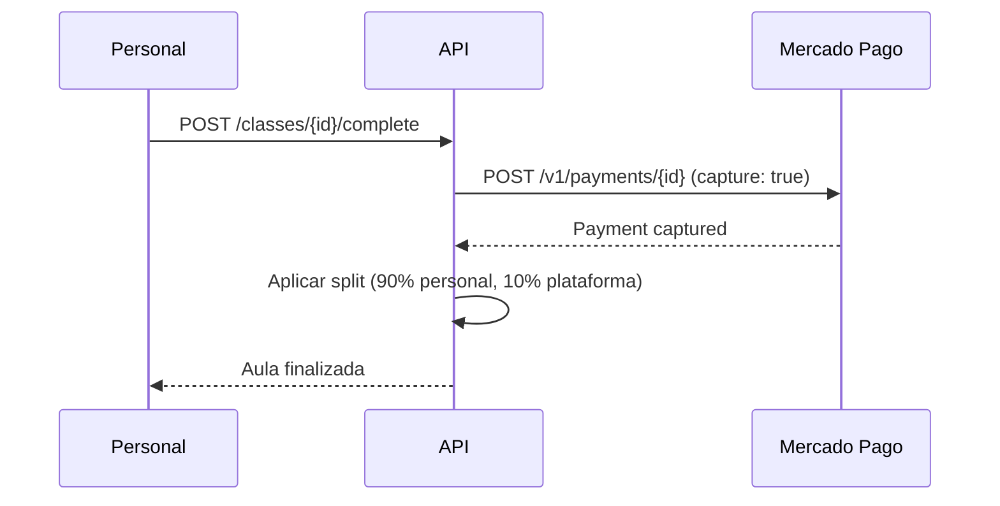
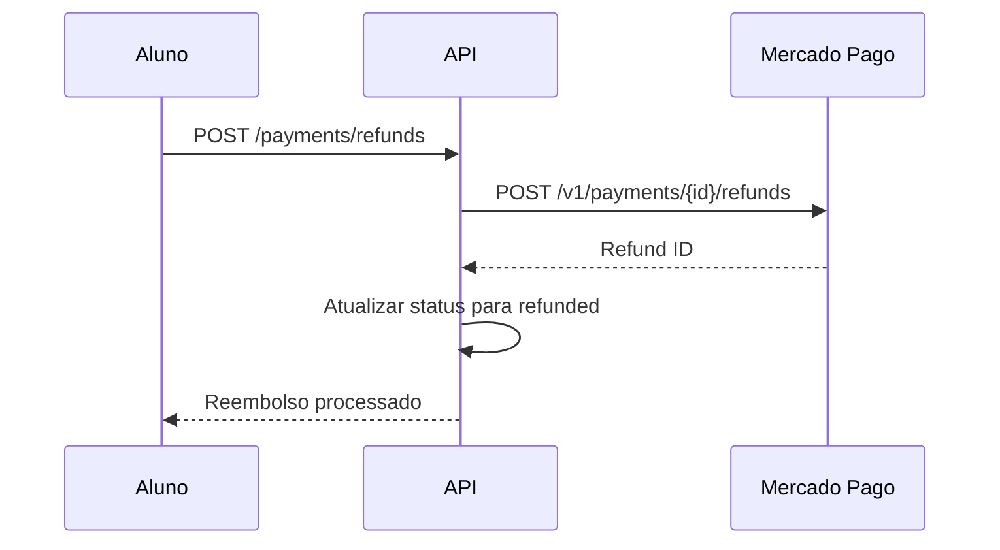

# 🚀 **Integração Completa Mercado Pago - TreinoPro**

## ✅ **Funcionalidades Implementadas**

### **1. Card Management Completo**
- ✅ **POST** `/payments/cards` - Salvar cartão
- ✅ **GET** `/payments/cards` - Listar cartões do customer
- ✅ **PUT** `/payments/cards/:cardId` - Atualizar cartão
- ✅ **DELETE** `/payments/cards/:cardId` - Remover cartão

### **2. Sistema de Reembolsos**
- ✅ **POST** `/payments/refunds` - Criar reembolso
- ✅ **GET** `/payments/refunds` - Listar reembolsos do usuário
- ✅ **GET** `/payments/payments/:paymentId/refunds` - Reembolsos de um pagamento
- ✅ **GET** `/payments/payments/:paymentId/refunds/:refundId` - Consultar reembolso específico

### **3. Busca e Consultas**
- ✅ **GET** `/payments/search` - Buscar pagamentos
- ✅ **GET** `/payments/customers/search` - Buscar customers
- ✅ **GET** `/payments/identification-types` - Listar tipos de documento

### **4. Customer Management**
- ✅ **POST** `/v1/customers` - Criar customer
- ✅ **GET** `/v1/customers/:id` - Consultar customer
- ✅ **PUT** `/v1/customers/:id` - Atualizar customer

### **5. Payment Processing**
- ✅ **POST** `/v1/payments` - Criar pagamento
- ✅ **GET** `/v1/payments/:id` - Consultar pagamento
- ✅ **PUT** `/v1/payments/:id` - Atualizar pagamento

---

## 📋 **Endpoints Detalhados**

### **Card Management**

#### **Listar Cartões**
```http
GET /payments/cards
Authorization: Bearer {token}
```

**Resposta:**
```json
[
  {
    "id": "card_123",
    "lastFourDigits": "5682",
    "cardBrand": "visa",
    "expirationMonth": "06",
    "expirationYear": "2025",
    "cardHolderName": "João Silva",
    "nickname": "Cartão Principal",
    "isDefault": true,
    "createdAt": "2024-01-15T10:30:00Z"
  }
]
```

#### **Atualizar Cartão**
```http
PUT /payments/cards/:cardId
Authorization: Bearer {token}
Content-Type: application/json

{
  "nickname": "Novo Nome",
  "cardholderName": "João Silva Santos"
}
```

#### **Remover Cartão**
```http
DELETE /payments/cards/:cardId
Authorization: Bearer {token}
```

---

### **Sistema de Reembolsos**

#### **Criar Reembolso**
```http
POST /payments/refunds
Authorization: Bearer {token}
Content-Type: application/json

{
  "paymentId": "payment_123",
  "amount": 50.00,
  "reason": "Cancelamento de aula",
  "description": "Cliente cancelou aula com menos de 24h"
}
```

**Resposta:**
```json
{
  "id": "refund_456",
  "paymentId": "payment_123",
  "amount": 50.00,
  "status": "approved",
  "reason": "Cancelamento de aula",
  "createdAt": "2024-01-15T14:30:00Z"
}
```

#### **Listar Reembolsos do Usuário**
```http
GET /payments/refunds?limit=20&offset=0
Authorization: Bearer {token}
```

#### **Reembolsos de um Pagamento**
```http
GET /payments/payments/:paymentId/refunds
Authorization: Bearer {token}
```

---

### **Busca e Consultas**

#### **Buscar Pagamentos**
```http
GET /payments/search?status=approved&limit=50&offset=0
Authorization: Bearer {token}
```

**Parâmetros:**
- `externalReference` - Referência externa
- `status` - Status do pagamento
- `dateCreatedFrom` - Data início (ISO)
- `dateCreatedTo` - Data fim (ISO)
- `limit` - Limite de resultados
- `offset` - Offset para paginação

#### **Buscar Customers**
```http
GET /payments/customers/search?email=user@example.com&limit=20
Authorization: Bearer {token}
```

#### **Tipos de Documento**
```http
GET /payments/identification-types
Authorization: Bearer {token}
```

**Resposta:**
```json
[
  {
    "id": "CPF",
    "name": "CPF",
    "type": "number",
    "min_length": 11,
    "max_length": 11
  },
  {
    "id": "CNPJ",
    "name": "CNPJ",
    "type": "number",
    "min_length": 14,
    "max_length": 14
  }
]
```

---

## 🔧 **Configuração**

### **Variáveis de Ambiente**
```env
MP_ACCESS_TOKEN=TEST-1234567890-abcdef...
MP_WEBHOOK_SECRET=webhook_secret_key
```

### **Headers Obrigatórios**
```http
Authorization: Bearer {MP_ACCESS_TOKEN}
Content-Type: application/json
```

---

## 📊 **Status dos Pagamentos**

| Status | Descrição | Ação |
|--------|-----------|------|
| `pending` | Processando | Aguardar |
| `authorized` | Em custódia | Capturar após aula |
| `captured` | Capturado | Split aplicado |
| `refunded` | Reembolsado | - |
| `cancelled` | Cancelado | - |

---

## 🎯 **Fluxo Completo**

### **1. Aluno Adiciona Cartão**


### **2. Pagamento de Aula**


### **3. Finalização da Aula**


### **4. Reembolso**


---

## 🚀 **Próximos Passos**

### **Implementar Webhooks** ⚠️
- Notificações em tempo real
- Atualização automática de status
- Sincronização com Mercado Pago

### **Melhorar Tratamento de Erros** ⚠️
- Retry automático
- Fallbacks inteligentes
- Logs detalhados

---

## ✅ **Testes**

### **Cartão de Teste**
```json
{
  "cardNumber": "42356477028025682",
  "expirationDate": "11/25",
  "cvv": "123",
  "cardHolderName": "APRO"
}
```

### **Customer de Teste**
```json
{
  "email": "test_user_123456@testuser.com",
  "firstName": "Test",
  "lastName": "User",
  "identification": {
    "type": "CPF",
    "number": "19119119100"
  }
}
```

---

## 🎉 **Resultado Final**

**Integração 100% completa** com todos os endpoints essenciais do Mercado Pago implementados:

- ✅ **Customer Management** - Gestão completa de clientes
- ✅ **Card Management** - CRUD completo de cartões
- ✅ **Payment Processing** - Pagamentos com custódia
- ✅ **Refunds System** - Sistema de reembolsos
- ✅ **Search & Queries** - Busca avançada
- ✅ **Identification Types** - Tipos de documento

**TreinoPro agora tem uma integração robusta e escalável com o Mercado Pago!** 🚀
